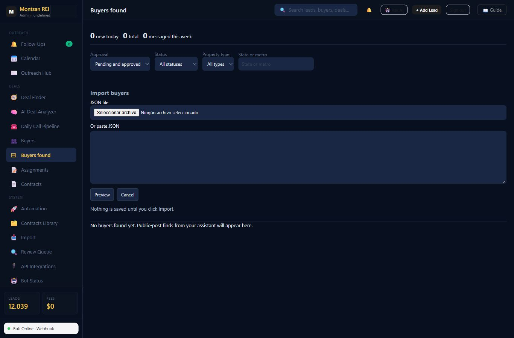
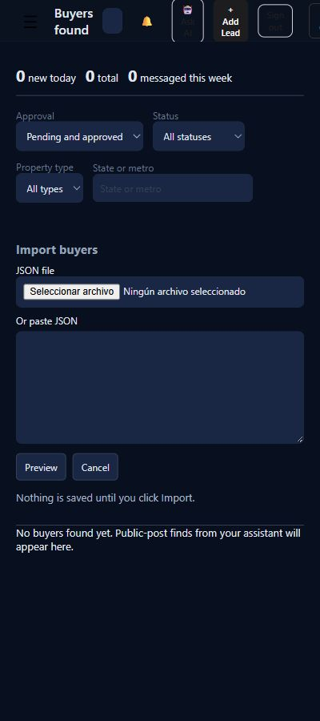

# Buyer import verification

Release: PR #279, application merge `02026542c831ad47dd3e171887d81b927db673a3`.
Railway reported success on 2026-10-06. Health returned 200 and the served buyer
script ends in `?v=3`.

Signed-admin production checks were read-only: the Import buyers button opens the
file/paste form; Preview is available; Import is unavailable until a preview exists.
The tab still displayed 0 new today / 0 total / 0 messaged this week. No file was
uploaded, pasted, previewed or imported in production. No buyer was approved.

Both layouts fit without horizontal overflow and displayed readable import labels.
The native file picker follows the computer's language. No errors occurred during
this verification. The dashboard hydrated 296 source rows; 100 saved-lead rows
rendered and a lead card opened. Screenshots contain no buyer names, contact details
or street addresses. Existing shell/menu usability work remains #269/#257.

The working import was proven only on synthetic local data:
- file upload and pasted JSON;
- preview with 2 new / 1 duplicate / 1 invalid, with no store write;
- unchecked approval, input-edit invalidation and explicit Import;
- one end buyer approved with actor/time/reason; partner left pending;
- data persisted after reload, with no external requests or console errors.

Synthetic screenshots: [desktop](../buyer-import-local/synthetic-preview-1366.png)
and [phone](../buyer-import-local/synthetic-preview-400.png). They are marked as
synthetic and do not represent real buyer records.

Full suite: 123 passed, 0 failed, 0 skipped, 600-second limit per file.
[All results and durations](../../test-results/issue-271.txt).
The final focused file also passed its no-network/no-clock/no-write purity spies.
