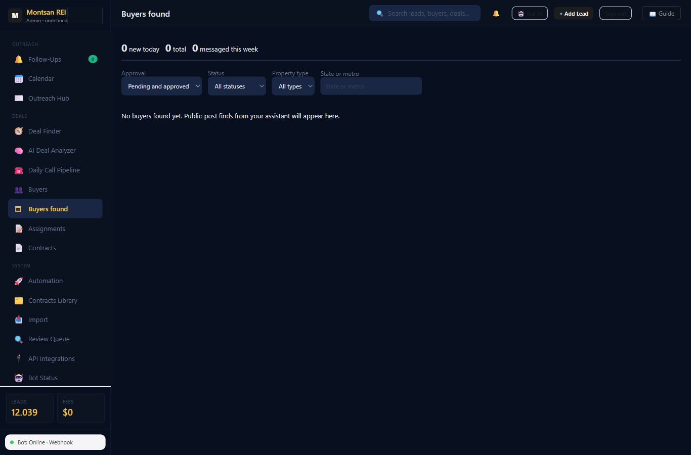
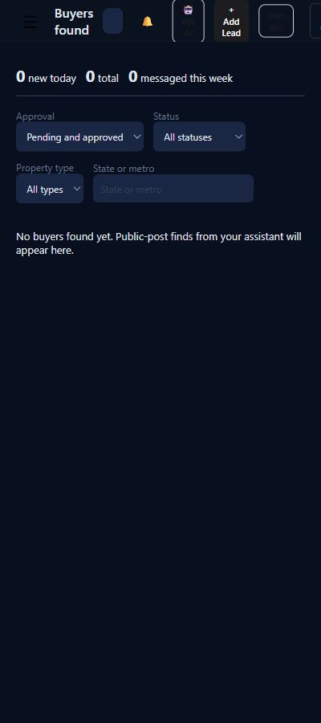

# Buyers found release verification

Application release: PR #274, merge `77b90fab021ed0f26cf28058072f9c4bf33e15af`.
Railway reported success. Read-only checks on 2026-10-06: health 200;
served `wos-buyers-found.js?v=2`; anonymous find reads returned 401;
signed dashboard hydrated 296 source rows in the selected county profile;
the national saved-lead view rendered 100 rows and a lead card opened.

The new tab loaded **0 new today, 0 total, 0 messaged this week**. Empty is the
expected result until real assistant finds are imported. Approval, structured
criteria, drafts, duplicate handling and fit counts were exercised on local
synthetic data, never by inventing a production buyer.

No horizontal overflow at either width. Counts and empty-state text are readable.
No browser errors were logged after the corrected release's merge at 15:52:48 UTC.
An older saved-leads 502 entry during the rollback deployment predates this check;
subsequent saved-lead loading and the card check succeeded.

These screenshots contain no buyer names, contact details or street addresses.
Existing shell limitations (muted form labels, header and mobile menu behavior)
remain for #269/#257; this verification does not claim those are fixed.

PR #268 was reverted because its light text styling did not work with the dark
dashboard. The failed phone capture is retained as [rollback evidence](failed-theme-400.jpg)
for #273. The local proof now loads the existing dashboard theme and checks
contrast >=4.5 for its populated and empty states. Synthetic examples are under
`../buyers-found-local/`; they are clearly marked as test data.

Full suite: 115 passed, 0 failed, 7 environment skips (600-second per-file limit).
[Per-file results and durations](../../test-results/issue-260.txt).
The real-server API session test also passed separately with process spawning
permitted; agent submissions cannot read finds or approve buyers.

No production import, approval, status edit, pairing, batch, enrichment, evidence
confirmation, contact action, phone unmask or paid call occurred.
